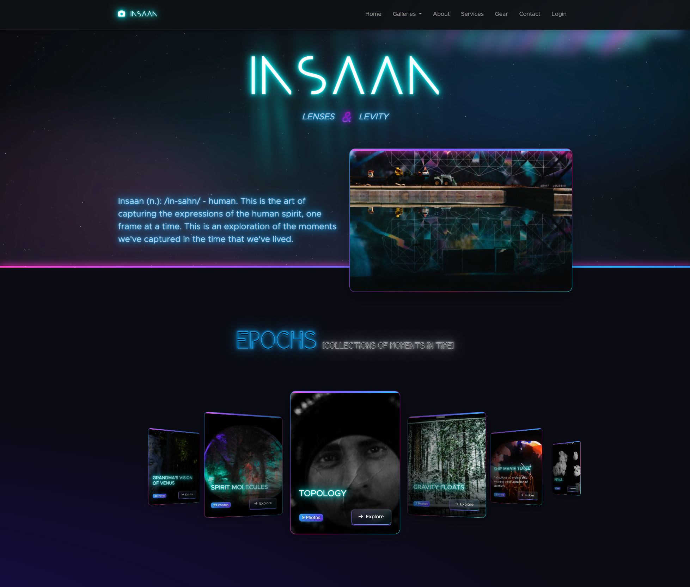

# Neon Glass

> A cyberpunk-inspired Bootstrap 5 theme featuring glassmorphism effects, neon accents, and advanced visual features.

Neon Glass is an aggressively styled Bootstrap theme designed as a drop-in overlay for dark-themed UIs. It combines glassmorphism aesthetics with vibrant neon glows, creating a distinctive cyberpunk visual experience.

## Features

- **Glassmorphism Cards** - Translucent surfaces with backdrop blur and animated neon border accents
- **Gradient Buttons** - Glossy borders with hover sheen effects and contextual color variants
- **Neon Components** - Chips, badges, and progress bars with customizable glow effects
- **Advanced Text Effects** - Multiple animated neon text styles (flicker, pulse, rainbow)
- **Lens Distortion System** - Real-time glass reflection and magnification effects using DOM capture
- **Pure CSS** - All components and utilities are CSS-only (except optional lens effects)
- **Fully Responsive** - Optimized for all screen sizes with mobile-first design
- **Dark UI Optimized** - Built specifically for dark-themed applications


## Demo

Check out the full demo with all components here https://codepen.io/digitalisstudios/full/VYeEZbe

### What it looks like

Here is a screenshot of a site using this theme a https://insaans.com




## Installation

### Basic Setup

Add the Neon Glass stylesheet after Bootstrap CSS to override default styles:

```html
<!-- Bootstrap 5 -->
<link href="https://cdn.jsdelivr.net/npm/bootstrap@5.3.3/dist/css/bootstrap.min.css" rel="stylesheet">

<!-- Neon Glass Theme -->
<link href="css/bootstrap-neon.css" rel="stylesheet">
```

### Optional Dependencies

For icons and advanced features:

```html
<!-- Font Awesome Icons -->
<link href="https://cdnjs.cloudflare.com/ajax/libs/font-awesome/6.5.2/css/all.min.css" rel="stylesheet">

<!-- html2canvas-pro (for lens distortion effects) -->
<script src="https://cdn.jsdelivr.net/npm/html2canvas-pro@1.5.11/dist/html2canvas-pro.min.js"></script>
<script src="js/lens.js"></script>
```

### Complete Template

```html
<!DOCTYPE html>
<html data-bs-theme="dark" lang="en">
<head>
  <meta charset="utf-8">
  <meta name="viewport" content="width=device-width, initial-scale=1.0">
  <title>Neon Glass App</title>

  <!-- Bootstrap CSS -->
  <link href="https://cdn.jsdelivr.net/npm/bootstrap@5.3.3/dist/css/bootstrap.min.css" rel="stylesheet">

  <!-- Font Awesome Icons -->
  <link href="https://cdnjs.cloudflare.com/ajax/libs/font-awesome/6.5.2/css/all.min.css" rel="stylesheet">

  <!-- Neon Glass Theme -->
  <link href="css/bootstrap-neon.css" rel="stylesheet">
</head>
<body>

  <!-- Your content here -->
  <div class="container my-5">
    <div class="card">
      <div class="neon-accent-line"></div>
      <div class="card-header">
        <h5 class="card-title mb-0">
          <i class="fas fa-bolt me-2"></i>
          Welcome to Neon Glass
        </h5>
      </div>
      <div class="card-body">
        <p>Your cyberpunk-themed application starts here.</p>
        <button class="btn btn-primary">Get Started</button>
      </div>
    </div>
  </div>

  <!-- Bootstrap Bundle JS -->
  <script src="https://cdn.jsdelivr.net/npm/bootstrap@5.3.3/dist/js/bootstrap.bundle.min.js"></script>

  <!-- Optional: Lens Effects -->
  <script src="https://cdn.jsdelivr.net/npm/html2canvas-pro@1.5.11/dist/html2canvas-pro.min.js"></script>
  <script src="js/lens.js"></script>

</body>
</html>
```

## Usage

### Cards

```html
<!-- Basic Glass Card -->
<div class="card">
  <div class="neon-accent-line"></div>
  <div class="card-body">
    <p>Glassmorphism card with neon accent</p>
  </div>
</div>

<!-- Hero Card (enhanced hover effects) -->
<div class="card card-hero">
  <div class="neon-accent-line"></div>
  <div class="card-body">
    <p>Enhanced glow and sheen on hover</p>
  </div>
</div>

<!-- Solid Card (opaque background) -->
<div class="card card-solid">
  <div class="card-body">
    <p>Solid background instead of glass</p>
  </div>
</div>
```

### Buttons

```html
<!-- Contextual Buttons -->
<button class="btn btn-primary">Primary</button>
<button class="btn btn-success">Success</button>
<button class="btn btn-danger">Danger</button>
<button class="btn btn-warning">Warning</button>
<button class="btn btn-info">Info</button>
<button class="btn btn-secondary">Secondary</button>

<!-- Sizes -->
<button class="btn btn-primary btn-sm">Small</button>
<button class="btn btn-primary">Default</button>
<button class="btn btn-primary btn-lg">Large</button>
```

### Badges & Chips

```html
<!-- Neon Chips -->
<span class="neon-chip">Standard Chip</span>
<span class="neon-chip neon-chip-rotating">Rotating Border</span>

<!-- Badges -->
<span class="badge badge-neon">Neon Badge</span>
<span class="badge bg-success">Success</span>
<span class="badge bg-danger">Danger</span>
```

### Text Effects

```html
<!-- Advanced Neon Text -->
<h1 class="text-neon-cyan-adv">Cyan Flicker</h1>
<h1 class="text-neon-pink-adv">Pink Pulse</h1>
<h1 class="text-neon-lime-adv">Lime Jitter</h1>
<h1 class="text-neon-blue-adv">Electric Blue Blink</h1>
<h1 class="text-neon-magenta-adv">Magenta Glow Cycle</h1>
<h1 class="text-neon-rainbow-adv">Rainbow Neon</h1>

<!-- Basic Neon Colors -->
<p class="text-neon-blue">Blue text</p>
<p class="text-neon-purple">Purple text</p>
<p class="text-neon-pink">Pink text</p>
<p class="text-neon-cyan">Cyan text</p>
```

### Alerts

```html
<div class="alert alert-neon alert-success" role="alert">
  <i class="fas fa-check-circle me-2"></i> Success message
</div>

<div class="alert alert-neon alert-info" role="alert">
  <i class="fas fa-info-circle me-2"></i> Info message
</div>

<div class="alert alert-neon alert-warning" role="alert">
  <i class="fas fa-exclamation-triangle me-2"></i> Warning message
</div>

<div class="alert alert-neon alert-danger" role="alert">
  <i class="fas fa-times-circle me-2"></i> Error message
</div>
```

### Forms

All standard Bootstrap form components are styled automatically:

```html
<input type="text" class="form-control" placeholder="Text input">
<select class="form-select">
  <option>Select option</option>
</select>
<textarea class="form-control" rows="3"></textarea>

<!-- Checkboxes and Radios -->
<div class="form-check">
  <input class="form-check-input" type="checkbox" id="check1">
  <label class="form-check-label" for="check1">Checkbox</label>
</div>

<!-- Switch -->
<div class="form-check form-switch">
  <input class="form-check-input" type="checkbox" id="switch1">
  <label class="form-check-label" for="switch1">Switch</label>
</div>
```

## Utility Classes

### Background Utilities

- `.bg-neon-glass` - Glassmorphism background
- `.bg-neon-gradient` - Neon gradient background
- `.bg-neon-blue-purple` - Blue to purple gradient
- `.bg-neon-night` - Dark night background

### Glow Effects

- `.neon-glow-blue` - Blue glow effect
- `.neon-glow-purple` - Purple glow effect
- `.neon-glow-pink` - Pink glow effect
- `.neon-glow-cyan` - Cyan glow effect

### Text Colors

- `.text-neon-blue`
- `.text-neon-purple`
- `.text-neon-pink`
- `.text-neon-cyan`

### Advanced Text Effects (Animated)

- `.text-neon-cyan-adv` - Cyan flicker
- `.text-neon-pink-adv` - Pink pulse
- `.text-neon-lime-adv` - Lime jitter
- `.text-neon-blue-adv` - Electric blue blink
- `.text-neon-magenta-adv` - Magenta glow cycle
- `.text-neon-amber-adv` - Amber pulse
- `.text-neon-toxic-adv` - Toxic green flicker
- `.text-neon-red-adv` - Hot red flicker
- `.text-neon-rainbow-adv` - Rainbow neon

## Advanced Features

### Lens Distortion Effects

The lens distortion system uses `html2canvas-pro` to capture actual page content behind glass elements, creating realistic magnification and edge distortion effects:

```html
<div class="bg-neon-glass lens-enabled p-4 rounded-5"
     data-lens-specular-enabled="true"
     data-lens-specular-strength="0.3">
  <h4>Interactive Demo</h4>
  <p>This element captures and warps the page content behind it.</p>
  <canvas class="lens-canvas"></canvas>
</div>
```

Requires:
- `html2canvas-pro` library
- `lens.js` script

## Customization

Override CSS variables to customize the theme:

```css
:root {
  --neon-cyan: #00f8f1;
  --neon-magenta: #ff00ff;
  --neon-pink: #ff006e;
  --neon-blue: #0066ff;
  --neon-purple: #b388ff;

  /* Glass effects */
  --neon-glass-bg: rgba(255, 255, 255, 0.05);
  --neon-glass-border: rgba(255, 255, 255, 0.15);
  --neon-glass-blur: 12px;
}
```

Create new components using the `.neon-*` prefix for consistency.

## Components

Full documentation with live examples available in `bootstrap-neon-documentation.html`:

- Cards (Basic, Hero, Solid)
- Buttons (All contextual variants and sizes)
- Forms (Inputs, Selects, Checkboxes, Radios, Switches, Validation)
- Badges & Chips
- Alerts
- Tabs
- Toasts
- Tables
- Pagination
- Modals
- Progress Bars

## Browser Support

- Latest Chrome, Firefox, and Safari
- Requires `backdrop-filter` support for glass effects
- Gracefully degrades in unsupported browsers
- Mobile-optimized and touch-friendly

**Note:** Some older browsers may not support all visual effects. The theme provides fallbacks for essential functionality.

## File Structure

```
bootstrap-neon/
├── src/
│   ├── css/
│   │   ├── bootstrap-neon.css
│   │   └── documentation.css
│   ├── js/
│   │   └── lens.js
│   └── bootstrap-neon-documentation.html
└── README.md
```

## Performance Considerations

- Prefer SVG and compressed images for optimal performance
- Lens distortion effects can be CPU-intensive; use sparingly
- Backdrop filters may impact performance on lower-end devices
- Consider disabling advanced animations for accessibility

## Credits

Powered by pure spite - Brandon Moore 2025

Built on top of:
- [Bootstrap 5.3.3](https://getbootstrap.com/)
- [Font Awesome 6.5.2](https://fontawesome.com/)
- [html2canvas-pro 1.5.11](https://html2canvas.hertzen.com/)

## License

This is a custom theme overlay for Bootstrap. Please respect Bootstrap's MIT license when using this theme.

---

**Note:** This theme is designed for dark UIs and works best with Bootstrap's dark mode enabled (`data-bs-theme="dark"`).
